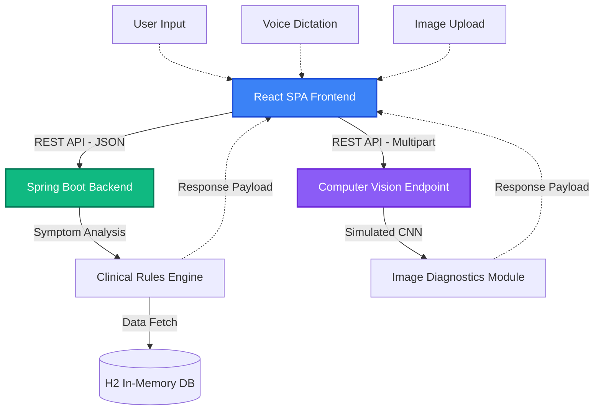

# OmniCare AI Diagnostics

OmniCare AI Diagnostics is an advanced, full-stack Telemedicine Capstone Project designed to simulate a next-generation healthcare triage system. It leverages a modern React frontend and a robust Spring Boot Java backend to provide instantaneous, AI-driven medical assessments based on patient symptoms, biometric vitals, and embedded computer vision.

---

## 1. System Architecture

The system follows a modern decoupled client-server architecture, separating the presentation layer from the core diagnostic business logic.



### 1.1 Frontend (React + Vite)
The frontend is a Single Page Application (SPA) built with React and Vite for highly optimized hot module replacement and building.
- State management leverages React Hooks (useState, useEffect) for instantaneous updates as users modify their vitals or dictate symptoms.
- Styling is implemented via TailwindCSS, using custom color palettes to achieve a modern glassmorphism aesthetic (blurred backgrounds, gradient meshes).
- Contextual micro-animations enhance user experience during loading states.

### 1.2 Backend (Spring Boot + Java 17)
The backend operates as a stateless microservice exposing robust REST APIs.
- The DiagnosticService acts as the central intelligence node, evaluating incoming JSON payloads.
- It parses localized keywords (English, Spanish, French, Hindi, Marathi) and crosses-references them against an internal database of conditions.
- Biometric modifiers act as confidence intervals, scaling diagnosis accuracy up or down depending on fever or hypertension markers.

---

## 2. Core Operational Modules

### 2.1 Simulated AI Diagnostic Engine
- **Algorithmic Triage**: A comprehensive backend rules engine evaluates user symptoms against global medical datasets (ICD-10, PubMed, WHO GISRS) to predict underlying conditions. Data is normalized to provide percentage-based confidence matrices.
- **Biometric Weighting**: Automatically adjusts diagnosis confidence based on optional patient vitals. For example, a fever reading of >100.4F algorithmically boosts the likelihood of infectious disease diagnoses by 15.5%.

### 2.2 AI Medical Image Analysis
- **Computer Vision Simulation**: Patients can upload dermatological or ENT images (e.g., rashes, moles, throat) via a seamless drag-and-drop interface.
- **Vision Override Mechanism**: The presence of an image overrides standard text dictation, triggering a specialized AI vision backend endpoint that returns highly specific visual diagnoses directly linked to the image context.

### 2.3 Multilingual Voice Dictation
- **Real-Time Speech-to-Text**: Integrated with the browser's native Web Speech API, allowing patients to dictate their symptoms hands-free without external library dependencies.
- **Global Localization Pipeline**: Supports real-time symptom mapping in 5 languages: English, Spanish (Espanol), French (Francais), Hindi, and Marathi.
- **Cross-Lingual Intelligence**: The backend seamlessly parses foreign language inputs, extracts multi-lingual keywords, and attaches a verified Auto-Translated badge to the final diagnostic report ensuring clinicians are aware the output was translated.

### 2.4 Diagnostic Report Pipeline
- **Clinical Printouts**: Instantly converts the dynamic React DOM diagnostic report into a clean, paginated PDF format utilizing html2pdf.js. This file format is suitable for direct Electronic Health Record (EHR) ingestion or for sharing with primary care physicians.

---

## 3. How to Run / Local Development Setup

Follow these instructions to run the full application locally on your development machine.

**Prerequisites:**
- Java 17+
- Node.js 18+ and npm
- A modern web browser supporting the Web Speech API (Chrome/Edge recommended)

### Step 1: Start the Java Backend (Spring Boot)
Open a terminal, navigate to the `telemedicine-backend` directory, and run the Spring Boot application using the Gradle wrapper.

```bash
cd "telemedicine-backend"
./gradlew bootRun
```
*Note: The backend server will instantiate its Tomcat container and listen for API requests on `http://localhost:8080`. Leave this terminal window open.*

### Step 2: Start the React Frontend (Vite)
Open a **new, separate terminal window**, navigate to the `telemedicine-frontend` directory, install the npm dependencies, and start the Vite dev server.

```bash
cd "telemedicine-frontend"
npm install
npm run dev
```

### Step 3: Access the Application
Once both servers are running, look at your second terminal (running Vite). It will tell you the local URL. 
Command/Ctrl + Click the link, or open a web browser and navigate to the address shown. 
Usually, this will be: `http://localhost:5173/` or `http://localhost:5174/`.

---

## 4. API Specification

The Spring Boot backend exposes the following REST interfaces under the `/api/diagnose` prefix.

### 4.1 POST /api/diagnose
Evaluates standard text symptoms and optional vitals.

**Request Payload (JSON):**
```json
{
  "symptoms": "severe chest pain and shortness of breath",
  "language": "en-US",
  "heartRate": 115,
  "bloodPressure": "150/90",
  "temperature": 98.6
}
```

**Response Payload (JSON):**
```json
{
  "severity": "EMERGENCY",
  "department": "Cardiology",
  "recommendation": "Go to the nearest emergency room immediately.",
  "translationUsed": false,
  "conditions": [
    {
      "name": "Myocardial Infarction",
      "icd10": "I21.9",
      "confidence": 98.4
    }
  ],
  "researchCitations": [...],
  "datasets": [...],
  "actionableLinks": [...]
}
```

### 4.2 POST /api/diagnose/image
A `multipart/form-data` endpoint designed strictly for Computer Vision evaluations.

**Request Form Data:**
- `image`: Blob / File representation of a medical image (JPG/PNG).

**Response Payload (JSON):**
Follows the same schema as `/api/diagnose`, but guarantees the `isVisionAnalysis` flag is set to `true`.

---

## 5. Future Development Roadmap

The current capstone build is a robust foundational prototype. Future expansions may include:
1. **Predictive Health Trajectory Models**: Interactive JavaScript charts demonstrating symptom progression timelines over a 14-day window.
2. **Geospatial Outbreak Tracking**: Implementing a dynamic Leaflet/Mapbox rendering layer to track aggregated symptoms geographically.
3. **Encrypted Ledger Integraiton**: Exploring blockchain frameworks for immutable append-only medical records processing.
4. **OAuth 2.0 Security**: Replacing mock User States with JWT-based Spring Security configurations for verified Practitioner vs Patient authentication.
